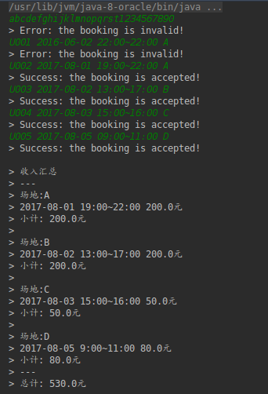
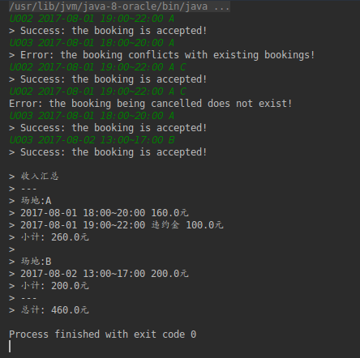

## 基本介绍

项目包含Utils.java、BadmintonCourt.java、BadmintonCourtImpl.java、Main.java、Order.java伍德源文件。

其中，BadmintonCourtImpl提供了羽毛球场预订、取消预订和打印收入汇总的功能；Order为订单，预订和取消预订以及打印收入汇总均是对Order对象进行操作；Utils提供了时间、日期的解析；Main类为主类，启动Main类的main方法即可启动本项目。

test目录下还有单元测试，对Order类、Utils类和BadmintonCourtImpl类里的部分方法进行了简单的测试。

下面是本项目对问题的两个测试用例的运行截图：

### 测试用例1:

### 测试用例2:

